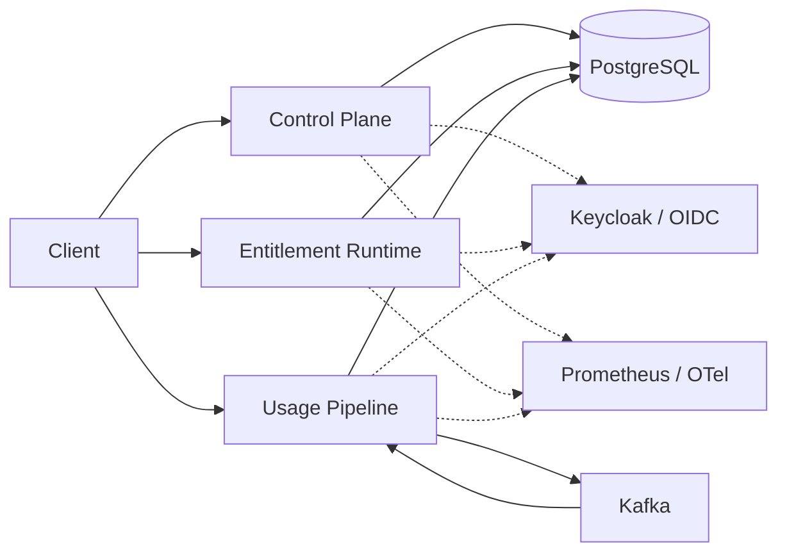
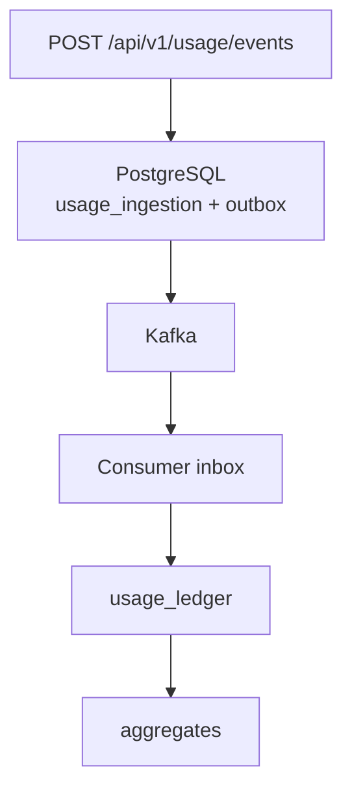
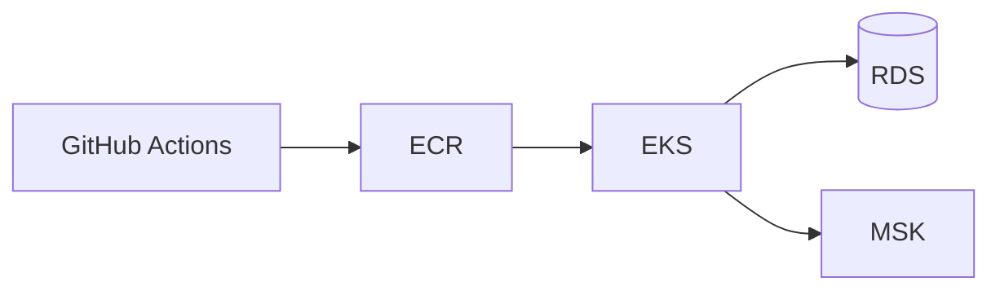

# UsageCore

### Multi-tenant entitlement, usage metering & quota infrastructure for B2B SaaS

UsageCore gives SaaS products one place to define entitlements, enforce usage limits, and keep auditable commercial history.

<p align="center">
  <a href="https://github.com/RPK2103/usagecore/actions/workflows/ci.yml"></a>
  
  
  
  
  
  
  
</p>

<p align="center"><b>Entitlements</b> · <b>Usage metering</b> · <b>Strict quotas</b> · <b>Contract history</b> · <b>Reconciliation</b></p>

<!--
VISUAL PLACEHOLDER:
Add a wide UsageCore hero image here.

Suggested visual:
- UsageCore logo/title
- Control Plane
- Entitlement Runtime
- Usage Pipeline
- PostgreSQL + Kafka
- dark technical product aesthetic

Recommended file: docs/assets/usagecore-hero.png
Recommended width: 1200–1600 px
-->

---

## What is UsageCore?

- Define what each customer is entitled to use — products, features, plans, and versioned contracts.
- Enforce contracted usage limits under concurrent traffic.
- Ingest and aggregate product usage asynchronously, without blocking the API on Kafka.
- Preserve contract versions, commercial periods, and usage history for audit and reconciliation.

## Live Demo

### ▶ Try UsageCore

> **Live:** [Live Demo — ADD DEPLOYED URL]

**Walkthrough:** [Demo walkthrough](docs/demo/README.md) — entitlement check, usage ingest, quota consume, and pipeline inspection.

<!--
SCREENSHOT PLACEHOLDER — entitlement / usage API demo
Suggested: entitlement check ALLOW_WITH_LIMIT response beside a usage 202 / consume ACCEPTED pair.
Where: local demo against Entitlement Runtime :8082 and Usage Pipeline :8083.
Crop: request + response JSON only, dark editor or HTTP client.
README placement: Live Demo or Try the core flow.
-->

---

## Why UsageCore?

| Capability | Benefit |
| --- | --- |
| Entitlements | Control which features each customer can access |
| Strict quotas | Prevent customers from exceeding contracted usage |
| Usage metering | Record usage without coupling APIs to Kafka processing |
| Contract history | Keep activated commercial terms as immutable evidence |
| Reconciliation | Compare canonical ledger usage with derived reporting state |
| Multi-tenancy | Isolate customer state through authenticated JWT tenant context |

---

## Features

**Commercial configuration** — multi-tenant catalogue of products, features, plans, and plan-feature limits; versioned contracts; entitlement modes `ENABLED` / `DISABLED` / `LIMITED`.

**Entitlements** — authenticated feature-access checks; tenant identity from JWT only; each decision leaves evidence.

**Usage metering** — authenticated ingest with idempotent request handling; event-time `SUM` / `COUNT` / `MAX`; daily and monthly windows; late-event handling.

**Quota enforcement** — strict synchronous consume; contract-aware limits; concurrent admission decided in PostgreSQL.

**Commercial lifecycle** — `OPEN` → `CLOSING` → `RECONCILING` → `FINALIZED`, so a period can close without silently rewriting history when delayed usage arrives.

**Reconciliation & corrections** — deterministic rebuild from the usage ledger; mismatch reporting; quarantined usage; explicit adjustments.

**Operations** — Prometheus, Grafana, OpenTelemetry; failure-recovery tests; Gatling performance lab; Kubernetes/Helm; Terraform AWS architecture; GitHub Actions.

| | |
| --- | --- |
| 🔐 Multi-tenant access | 📜 Versioned contracts |
| ✅ Entitlement decisions | 📊 Usage aggregation |
| 🚦 Strict quota enforcement | ⏱ Event-time windows |
| 📦 Transactional outbox | 🔁 Idempotent consumers |
| 🧾 Usage ledger | 🔍 Reconciliation |
| 🛠 Explicit corrections | 📈 Observability |
| 🧪 Failure testing | ⚡ Performance lab |
| ☸ Kubernetes | ☁️ AWS + Terraform |

---

## How it works

Three independently deployable workloads share PostgreSQL as the source of truth. Kafka carries usage events at-least-once. Keycloak is the local OIDC issuer.



<!--
SCREENSHOT PLACEHOLDER — UsageCore architecture visual
Suggested: three workloads, PostgreSQL as source of truth, Kafka as transport, OIDC on the side.
Where: export from docs/architecture/diagrams.md or a designed system poster.
Crop: wide landscape, no ADR/phase labels.
README placement: How it works, above or below the Mermaid diagram.
-->

### Durable usage processing



Transport is at-least-once; duplicate business effects are prevented through persisted event identity and the consumer inbox.

---

## Architecture

| Workload | Purpose |
| --- | --- |
| **Control Plane** `:8080` | Configure tenants, products, plans, contracts, and commercial periods |
| **Entitlement Runtime** `:8082` | Authenticated read-only entitlement decisions against activated snapshots |
| **Usage Pipeline** `:8083` | Ingest usage, enforce quota, and process usage asynchronously |

---

## Engineering Highlights

- PostgreSQL-backed transactional outbox for durable asynchronous ingestion.
- Consumer inbox prevents duplicate Kafka delivery from duplicating business state.
- Database-backed quota enforcement remains correct across concurrent replicas.
- Event-time daily/monthly usage windows preserve original occurrence time.
- Finalized commercial periods keep delayed usage as ledger evidence and quarantine it instead of rewriting aggregates.
- Reconciliation rebuilds expected state from canonical ledger evidence; corrections are explicit.
- Failure scenarios are tested against real PostgreSQL/Kafka containers.
- Kubernetes scaling and restart behavior was validated on a local kind cluster.

## Built around real backend failure cases

Kafka unavailable during ingest · duplicate event delivery · crash between Kafka ACK and outbox status update · consumer redelivery after DB commit · concurrent quota exhaustion · late usage events · finalized commercial periods · pod restart with pending outbox work

[Failure matrix](docs/resilience/failure-matrix.md) · [Kubernetes drills](docs/kubernetes/failure-matrix.md)

---

## Tech Stack

| Area | Technologies |
| --- | --- |
| **Backend** | Java 21, Spring Boot 3, Spring Security, Spring Data JPA (Control Plane), JDBC (Entitlement Runtime, Usage Pipeline), Maven |
| **Data & messaging** | PostgreSQL, Flyway, Apache Kafka |
| **Identity** | OIDC / JWT (Keycloak locally) |
| **Testing** | JUnit 5, Mockito, REST Assured, Testcontainers, ArchUnit, Awaitility |
| **Observability** | Micrometer, OpenTelemetry, Prometheus, Grafana |
| **Performance** | Gatling, Java Flight Recorder, PostgreSQL `EXPLAIN ANALYZE` |
| **Platform** | Docker, Kubernetes, Helm, Terraform, AWS architecture, GitHub Actions |

## Observable by default

- Structured, correlation-aware logs
- Prometheus metrics
- OpenTelemetry tracing (W3C Trace Context)
- Grafana operational dashboards
- Alert rules and runbooks

[Local observability](docs/observability/local-observability.md)

<!--
SCREENSHOT PLACEHOLDER — Grafana dashboard
Suggested: UsageCore — Usage Delivery & Commercial Enforcement (outbox pending, quota decisions, consumer results).
Where: local Grafana at http://localhost:3000 after Compose + the three workloads are running.
Crop: dashboard panels only, 1200–1600 px wide.
README placement: Observable by default.
-->

---

## Run locally

**Prerequisites:** Java 21, Docker, Docker Compose.

```powershell
docker compose -f infrastructure/docker/docker-compose.yml up -d

.\mvnw.cmd -pl applications/control-plane,applications/entitlement-runtime,applications/usage-pipeline -am install -DskipTests

java -jar applications/control-plane/target/control-plane-0.1.0-SNAPSHOT.jar
java -jar applications/entitlement-runtime/target/entitlement-runtime-0.1.0-SNAPSHOT.jar
java -jar applications/usage-pipeline/target/usage-pipeline-0.1.0-SNAPSHOT.jar

.\performance\scripts\seed.ps1
```

Unix: `./mvnw` with the same Compose and `java -jar` commands.

Full local setup → [docs/demo/README.md](docs/demo/README.md)

## Try the core flow

1. Authenticate with the local OIDC provider (Keycloak).
2. Check an entitlement.
3. Submit a usage event.
4. Consume strict quota.
5. Inspect usage / aggregate state.

Commands and expected responses: [Demo walkthrough](docs/demo/README.md) · [API examples](docs/demo/api-examples.md)

| API | Purpose |
| --- | --- |
| `POST /api/v1/entitlements/check` | Check whether a feature is allowed |
| `POST /api/v1/usage/events` | Record asynchronous usage |
| `POST /api/v1/usage/consume` | Perform strict quota-aware consumption |

---

## Deployment

- Docker Compose for local dependencies
- Kubernetes + Helm, validated on kind
- AWS target architecture: EKS, RDS, MSK
- Terraform IaC
- GitHub Actions CI/CD



[Kubernetes](docs/kubernetes/README.md) · [AWS architecture](docs/aws/README.md) · [CI/CD](docs/cicd/README.md)

<!--
SCREENSHOT PLACEHOLDER — Kubernetes workload view
Suggested: kubectl/k9s or Helm release showing control-plane, entitlement-runtime, usage-pipeline Ready.
Where: local kind cluster from docs/kubernetes/.
Crop: workload list + probes/replicas; no secrets.
README placement: Deployment.
-->

---

## Explore the engineering

| | |
| --- | --- |
| [Architecture](docs/architecture/diagrams.md) | [Demo walkthrough](docs/demo/README.md) |
| [Engineering evidence](docs/evidence/engineering-evidence.md) | [Resilience](docs/resilience/failure-matrix.md) |
| [Performance](docs/performance/summary.md) | [Kubernetes](docs/kubernetes/README.md) |
| [AWS](docs/aws/README.md) · [CI/CD](docs/cicd/README.md) | [Full docs index](docs/README.md) |
