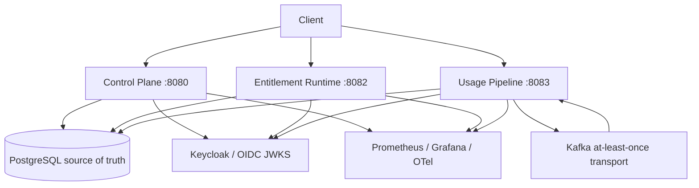
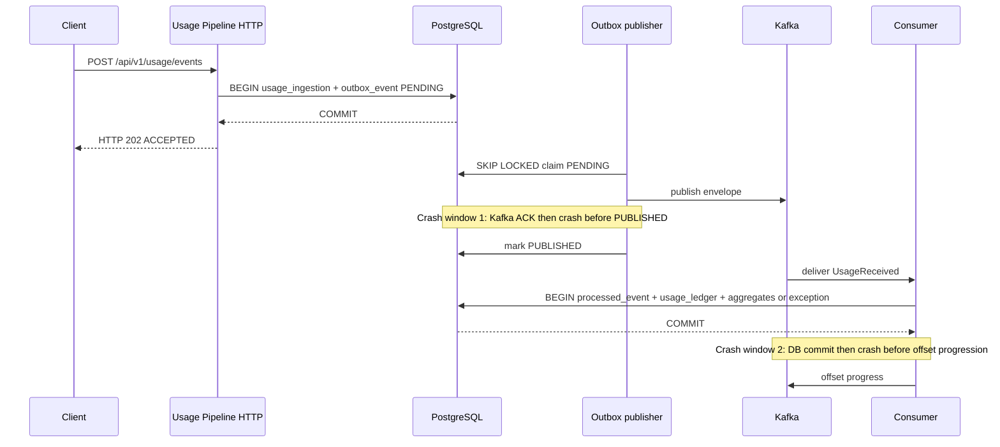
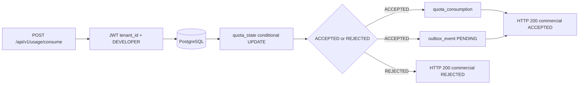
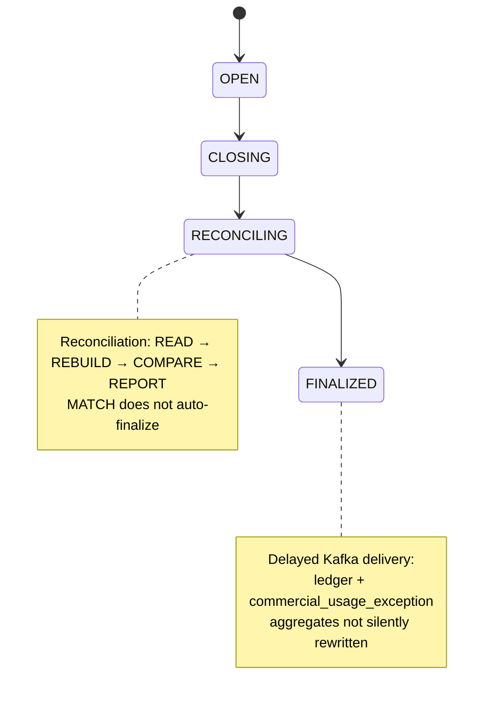
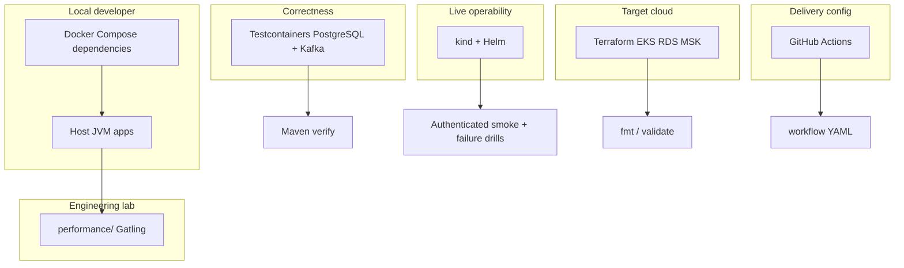

# Architecture diagrams

Canonical diagrams for evaluators. Prose details live in [system overview](system-overview.md) and [source of truth](source-of-truth.md).

PostgreSQL remains correctness authority in every diagram. Kafka is transport.

## 1. Runtime architecture

Workloads:

- **Control Plane** — catalogue, contracts, commercial periods; production Flyway owner.
- **Entitlement Runtime** — authenticated read-only entitlement checks.
- **Usage Pipeline** — ingest, outbox, consumer, quota, reconciliation, adjustments.

Not services: `performance/` (lab), Terraform (infra code), shared libraries (SQL / envelopes).

## 2. Usage / outbox / inbox flow

Duplicates are possible at the **transport** layer in both crash windows. Business effects are deduplicated by inbox uniqueness (`processed_event`) and ingest idempotency keys.

HTTP 202 does not mean Kafka published, the consumer ran, or commercial totals changed.

## 3. Strict quota path

Reporting aggregates are not consulted for admission. A JVM lock cannot be the authority across Usage Pipeline replicas.

Flagship invariant (tested): limit 100, consumed 90, 20 concurrent quantity-1 requests → exactly 10 `ACCEPTED`, final consumed 100.

## 4. Commercial lifecycle and reconciliation

Corrections after quarantine: explicit `usage_adjustment` (`APPLY_QUARANTINED_USAGE` only). Reconciliation does not auto-repair.

## 5. Deployment / evidence topology

See [deployment matrix](deployment-matrix.md) for evidence labels.
