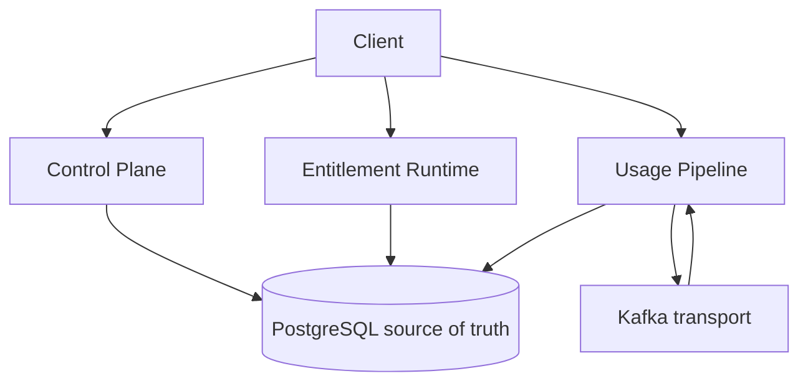

# System overview

UsageCore is a multi-tenant B2B SaaS infrastructure platform for commercial entitlements, usage metering, strict quota enforcement, contract-version history, commercial period finalization, reconciliation, and failure-safe event processing.

PostgreSQL is the transactional source of truth. Delivery semantics are at-least-once; end-to-end exactly-once is not claimed.

Diagrams: [diagrams.md](diagrams.md). Authority table: [source-of-truth.md](source-of-truth.md). Environments: [deployment-matrix.md](deployment-matrix.md).



## Logical workloads

| Workload | Responsibility |
| --- | --- |
| control-plane | Catalog and commercial configuration: Tenant, Product, Feature, Plan, MeterDefinition, Contract, ContractVersion activation, **CommercialPeriod** lifecycle; **production Flyway owner** |
| entitlement-runtime | Authenticated entitlement checks against activated contract snapshots; decision evidence; no Control Plane compile-time dependency ([ADR-007](../adr/ADR-007-entitlement-runtime-read-architecture.md)) |
| usage-pipeline | Durable usage ingestion, transactional outbox, idempotent consumer ledger + aggregates, synchronous contract-aware quota consume, **commercial-period enforcement**, **reconciliation rebuild/compare/report**, **explicit UsageAdjustment**, **failure-recovery evidence**; no Control Plane / Entitlement Runtime compile-time dependency ([ADR-008](../adr/ADR-008-kafka-usage-topology.md)–[ADR-019](../adr/ADR-019-resilience-and-failure-recovery.md)) |

Build only workloads required by the active milestone. No frontend in this repo.

Shared modules (not services):

- Flyway SQL: [`libraries/database-migrations`](../../libraries/database-migrations/README.md)
- Kafka transport contracts: [`libraries/event-contracts`](../../libraries/event-contracts/README.md) (envelopes only — not a business-domain mega-library)

Also not services: `performance/` (measurement lab) and `infrastructure/terraform/` (infrastructure code).

## Boundaries

```
┌─────────────────────────────────────────────────────────┐
│ adapters (HTTP, messaging, persistence)                 │
├─────────────────────────────────────────────────────────┤
│ application services (use cases)                        │
├─────────────────────────────────────────────────────────┤
│ domain (entities, policies, invariants)                 │
│   — no Spring MVC / Kafka / JDBC / AWS / HTTP deps      │
└─────────────────────────────────────────────────────────┘
                              │
                              ▼
                     PostgreSQL (SoT)
                              │
                     Kafka (usage transport)
```

See [ADR-001](../adr/ADR-001-application-boundaries.md).

## Tenancy

Shared PostgreSQL schema with tenant-aware isolation. Application code must scope all reads/writes by tenant. PostgreSQL RLS is deferred for v1 ([ADR-006](../adr/ADR-006-postgresql-rls.md); see also [ADR-002](../adr/ADR-002-postgresql-tenancy.md)).

Usage ingestion never accepts `tenantId` from the request body; tenant comes only from the validated JWT.

## Commercial model (summary)

- **Plans** are reusable templates ([ADR-004](../adr/ADR-004-plan-vs-contract.md)).
- **Contracts / ContractVersions** are the commercial truth for a tenant–product relationship.
- Activated `ContractVersion` state (and entitlement snapshots) is immutable ([ADR-003](../adr/ADR-003-contract-historical-state.md)).
- Effective time uses half-open intervals `[effectiveFrom, effectiveUntil)` in UTC-compatible timestamps ([ADR-005](../adr/ADR-005-temporal-model.md)).

## Source of truth (compact)

| Concern | Authority |
| --- | --- |
| Commercial configuration | Activated `ContractVersion` / `entitlement` |
| Canonical usage | `usage_ledger` |
| Ingest durability | `usage_ingestion` + `outbox_event` |
| Dedup | `processed_event` |
| Reporting | `usage_aggregate` / `usage_window_aggregate` |
| Strict quota | `quota_state` / `quota_consumption` |
| Lifecycle | `commercial_period` |
| Delayed/finalized exceptions | `commercial_usage_exception` |
| Reconciliation | `reconciliation_run` / `reconciliation_item` |
| Corrections | `usage_adjustment` |

## Flagship HTTP semantics

| API | Semantics |
| --- | --- |
| `POST /api/v1/entitlements/check` | Read-only commercial decision. Does not consume quota. |
| `POST /api/v1/usage/events` | HTTP 202 = durable PostgreSQL acceptance. Not Kafka/consumer/quota completion. |
| `POST /api/v1/usage/consume` | Synchronous strict quota admission. PostgreSQL is concurrency authority. |

## Usage pipeline (Phase 8B)

- Topic: `usagecore.usage.received.v1` (DLQ: `usagecore.usage.received.v1.dlq`)
- Partition key: `tenantId|productKey|meterKey` (ordering within partition; hot-partition trade-off documented in ADR-008)
- `POST /api/v1/usage/events` → HTTP 202 = durable PostgreSQL acceptance (ingestion + outbox) — **not** strict quota and **not** commercial-period rejection
- `POST /api/v1/usage/consume` → HTTP 200 commercial `ACCEPTED`/`REJECTED` with PostgreSQL-authoritative `quota_state`; rejects CLOSING/RECONCILING/FINALIZED periods ([ADR-013](../adr/ADR-013-contract-aware-quota-enforcement.md), [ADR-014](../adr/ADR-014-commercial-period-lifecycle.md))
- Consumer: `processed_event` inbox + immutable `usage_ledger` + lifetime/window aggregates **or** `commercial_usage_exception` when period is RECONCILING/FINALIZED
- Aggregation from Control Plane `MeterDefinition` (`SUM` / `COUNT` / `MAX`, `MONTHLY` / `DAILY` UTC windows) via shared-schema JDBC read
- Meter → Feature via explicit `MeterDefinition.featureId` for contractual quota
- Window ownership uses `occurredAt`; late arrivals update historical windows while period is OPEN/CLOSING/NO_PERIOD
- CommercialPeriod is lifecycle authority; usage windows are not overloaded with finalized flags
- Phase 8A reconciliation: deterministic rebuild from `usage_ledger` → compare derived window aggregates / quota divergence → immutable report (`reconciliation_run` / `reconciliation_item`). No silent repair, no Kafka historical replay ([ADR-015](../adr/ADR-015-reconciliation-and-deterministic-rebuild.md))
- Phase 8B: `POST /api/v1/reconciliation/runs/{runId}/exceptions/{exceptionId}/adjustments` applies quarantined canonical usage via immutable `usage_adjustment`; lifetime/window aggregates update atomically; `quota_state` unchanged ([ADR-016](../adr/ADR-016-explicit-usage-adjustments.md))
- Delivery remains at-least-once; duplicate redelivery is a successful no-op
- Kafka Streams deferred — PostgreSQL UPSERT retained for transactional correctness with inbox/ledger

## Observability (Phase 9A–9B)

Metrics, traces, structured logs, and operational dashboards describe existing behavior. They are not commercial correctness authority.

- Micrometer + Prometheus + OpenTelemetry (W3C Trace Context) on all three workloads ([ADR-017](../adr/ADR-017-observability-architecture.md))
- `correlationId` (HTTP `X-Correlation-Id`) remains distinct from `traceId`
- HTTP → outbox envelope evidence → Kafka `traceparent` → consumer processing is correlatable
- Custom Prometheus labels are bounded enums only — never tenant/event/request ids
- Usage Pipeline readiness depends on PostgreSQL; Kafka down is degraded async delivery, not HTTP-ingestion failure
- Local Prometheus + Grafana + OTel Collector: [local observability](../observability/local-observability.md); metric catalogue: [metrics.md](../observability/metrics.md); alerts: [alerts.md](../observability/alerts.md)
- Grafana dashboards and demo alert rules: [ADR-018](../adr/ADR-018-operational-dashboards-and-alerting.md). No automatic remediation.

## Resilience (Phase 10)

Selected dependency-failure windows are proven with Testcontainers pause/unpause and test-only seams. HTTP 202 remains durable PostgreSQL acceptance. Kafka ACK-before-outbox-PUBLISHED and consumer DB-commit-before-offset may duplicate transport; inbox/outbox keep a single business effect. See [ADR-019](../adr/ADR-019-resilience-and-failure-recovery.md) and the [failure matrix](../resilience/failure-matrix.md). Not production HA, not disaster recovery, not exactly-once.

## Performance laboratory (Phase 11)

A Gatling module under `performance/` measures entitlement check, durable ingest HTTP 202, and strict consume as **separate** workloads on a local Compose stack. Warm-up is excluded from headlines. Local percentiles are not production capacity. See [ADR-020](../adr/ADR-020-performance-engineering-and-benchmark-methodology.md) and [performance lab](../performance/README.md).

## Local Kubernetes deployment (Phase 12)

Phase 12 validates the same three workloads as containers on a **kind** cluster ([ADR-021](../adr/ADR-021-kubernetes-packaging-and-operability.md)). This is operability evidence, not production topology.

```
Client (port-forward / local)
        │
        ▼
┌───────────────────────────────────────────────────┐
│  namespace: usagecore                             │
│  ┌─────────────────┐ ┌──────────────────────────┐ │
│  │ control-plane   │ │ entitlement-runtime (×2) │ │
│  │ (Flyway owner)  │ │ usage-pipeline (×2)      │ │
│  └────────┬────────┘ └────────────┬─────────────┘ │
│           │                       │               │
│           └───────────┬───────────┘               │
│                       ▼                           │
│              PostgreSQL (PVC)                     │
│                       │                           │
│         usage-pipeline outbox ──► Kafka           │
│                       │                           │
│              Keycloak (JWKS)                      │
└───────────────────────────────────────────────────┘
```

- Docker Compose remains the developer dependency stack for host-run JVMs.
- Kubernetes adds container orchestration drills: probe semantics, replica scaling, pod restart, rolling update.
- External Compose Prometheus/Grafana may scrape port-forwarded `/actuator/prometheus`.
- Not proven: EKS, managed RDS/MSK, multi-AZ, backup/restore, production secret management.

See [kubernetes docs](../kubernetes/README.md) and [failure matrix](../kubernetes/failure-matrix.md).

## AWS target architecture (Phase 13)

The same three workloads map to managed AWS services. Domain authorities do not change.

```
Internet / client
        │
        ▼
       ALB
        │
        ▼
┌───────────────────────────────────────────────────┐
│  Amazon EKS                                       │
│  ┌─────────────────┐ ┌──────────────────────────┐ │
│  │ control-plane   │ │ entitlement-runtime (×2) │ │
│  │ (Flyway owner)  │ │ usage-pipeline (×2)      │ │
│  └────────┬────────┘ └────────────┬─────────────┘ │
│           │                       │               │
│           └───────────┬───────────┘               │
│                       ▼                           │
│         Amazon RDS PostgreSQL (private)           │
│                       │                           │
│         usage-pipeline outbox ──► Amazon MSK      │
└───────────────────────────────────────────────────┘
        ECR · Secrets Manager · external OIDC issuer
```

| Environment | Role |
| --- | --- |
| Docker Compose | Developer dependency stack for host-run JVMs |
| kind + Helm | Local Kubernetes operability evidence (Phase 12) |
| AWS Terraform | Target cloud topology; **configuration validated**, not live-applied unless explicitly authorized |
| GitHub Actions | PR gates, image identity, OIDC-gated deploy; **configuration**, not live GitHub/AWS execution unless recorded |

See [ADR-022](../adr/ADR-022-aws-deployment-architecture-and-terraform.md) and [AWS docs](../aws/README.md).

## Delivery (Phase 14)

```
Developer
        │
        ▼
   GitHub pull request
        │
        ▼
   CI + security + image build
        │
        ▼
   merge to main
        │
        ▼
   immutable images (git SHA)
        │
        ▼
   optional ECR publish (OIDC)
        │
        ▼
   gated dev deploy (environment + workflow_dispatch)
        │
        ▼
   EKS + Helm + smoke
```

Runtime architecture is unchanged: three workloads, PostgreSQL authority, Kafka at-least-once transport. See [CI/CD docs](../cicd/README.md) and [ADR-023](../adr/ADR-023-github-actions-ci-cd-and-supply-chain-security.md).
