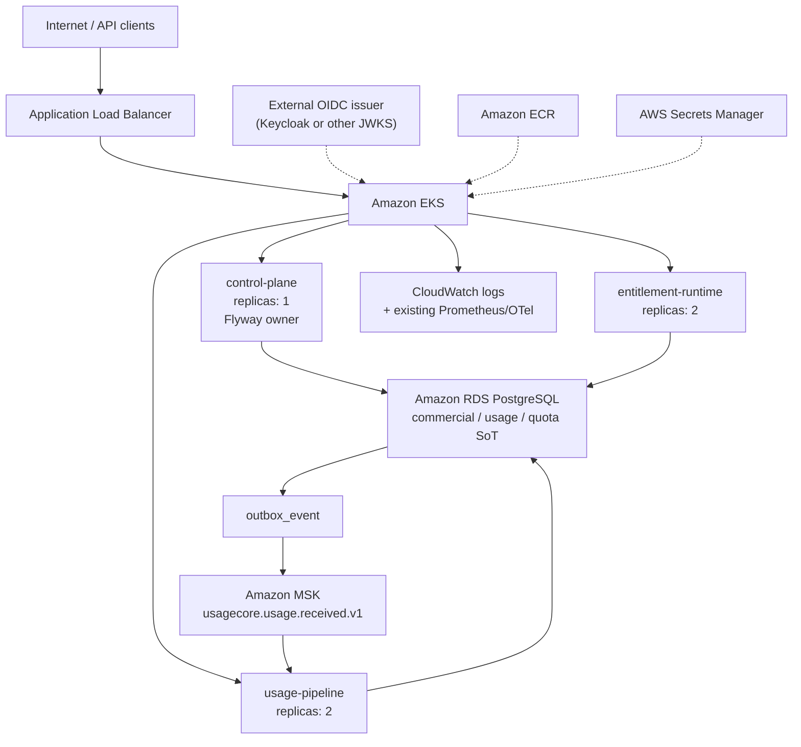

# AWS architecture

## Topology

Separate hostnames keep `/api/v1/...` unchanged. Path-prefix routing would require rewrites that break existing Spring mappings.

## Service mapping

| Need | AWS service | Why this and not an alternative |
| --- | --- | --- |
| Workloads | EKS | Phase 12 Helm/Kubernetes evidence carries forward |
| Images | ECR | Immutable tags for the three runtime images |
| PostgreSQL | RDS for PostgreSQL | Constraints, exclusion constraints, transactions; not DynamoDB |
| Kafka | Provisioned MSK | At-least-once transport preserved; not SQS/SNS |
| Ingress | ALB via AWS Load Balancer Controller | One ingress layer; not API Gateway + ALB |
| Secrets | Secrets Manager | Not Git, Helm values, or ConfigMaps |
| Network | VPC | Public ALB subnets; private app and data subnets |
| Identity to AWS APIs | EKS Pod Identity | For the load balancer controller; applications do not need AWS APIs |

Not used: Lambda, CloudFront, ElastiCache/Redis, DynamoDB, SQS/SNS, WAF, Cognito, Route 53 zones.

## Sources of truth (unchanged)

- **PostgreSQL** — catalog, activated contracts, ledger, aggregates, quota, commercial periods, reconciliation
- **JWT `tenant_id`** — tenant; not ALB headers, not IAM identity
- **Kafka** — asynchronous usage transport; HTTP 202 remains durable PostgreSQL acceptance
- **Activated ContractVersion / commercial-period / adjustment rows** — immutable historical evidence

AWS hosts these components. It does not redefine them.

## Keycloak / OIDC

Local Compose and kind still use Keycloak. AWS architecture consumes an **externally managed** standards-compliant OIDC/JWT issuer. Keycloak is not deployed as an EKS production IdP in this phase. Cognito is out of scope.

## Observability

Phase 9 Micrometer / Prometheus / OpenTelemetry remains the application metrics/traces model. CloudWatch is used for EKS control-plane logs (and container stdout collection once a node log agent exists). Amazon Managed Service for Prometheus is not added.

## Multi-AZ

- VPC and EKS nodes span 2–3 AZs (default 3).
- RDS Multi-AZ is **configurable** and **off** in the dev default.
- MSK uses 2 brokers in 2 data subnets by default (cost), not 3 brokers in 3 AZs.

Architecture design ≠ live failover evidence.
